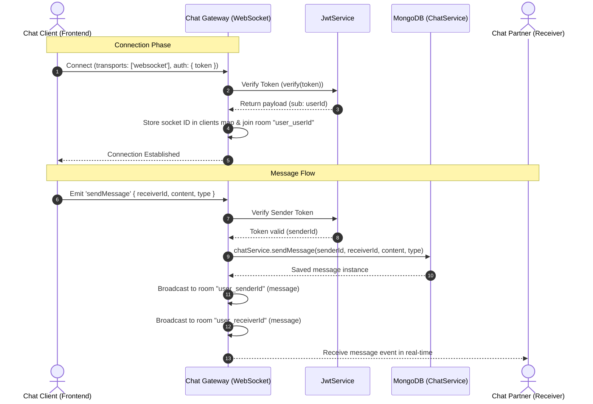
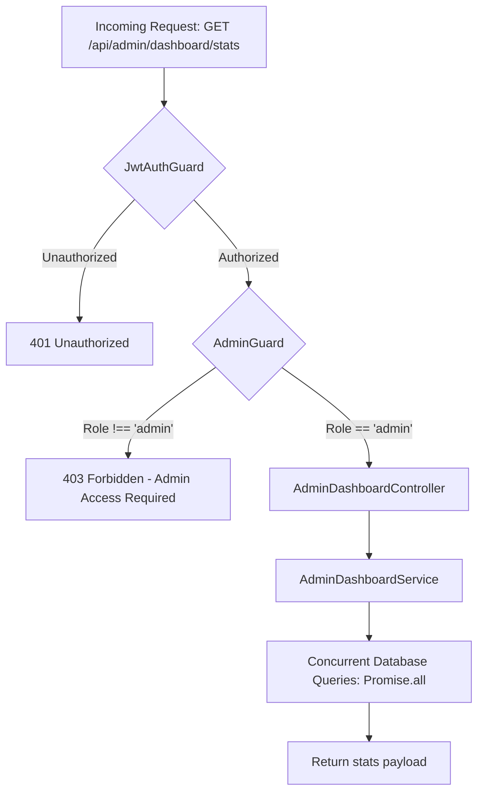

# Development & Architecture Guide: WebSocket Chat & Admin Systems

Use this structured guide to explain your implementation, the choices of library dependencies, and the methodologies used in the **Material Xchange Platform** codebase.

---

## 1. WebSocket Chat System & Auth Gateway Flow

### The Architecture Flow


### How It Works (The Method)
1. **Connection & Authentication:** When a user opens the chat, the frontend client makes a WebSocket connection. It passes the raw JWT token inside the `auth` handshake object. The `ChatGateway` interceptor verifies this token using `@nestjs/jwt`. If it is invalid or missing, it immediately calls `socket.disconnect()` to prevent unauthorized connections.
2. **Client Registry & Rooms:** To enable target broadcasting without sending data to unintended users, the gateway maintains an in-memory map of active clients (`Set<string>` of socket IDs per `userId`). The socket also joins a channel named `user_<userId>`.
3. **Optimized Multi-Device Real-Time Delivery:** When `sendMessage` is received, the gateway calls `ChatService` to persist the message in MongoDB. Once saved, it uses `socket.io` rooms to broadcast the message to the sender's room and the receiver's room. This ensures that if the same user is logged in on multiple tabs/devices, their chat histories synchronize in real-time across all their screens.
4. **Cloudflare-Ready CORS Alignment:** The gateway CORS setup mirrors the HTTP API CORS rules in `main.ts`. It dynamically validates the origin, permitting localhost connections for development, `https://material-exchange-platform.pages.dev` for production, and wildcard preview domains matching `*.material-exchange-platform.pages.dev` generated by Cloudflare Pages.

---

## 2. Admin Dashboard & Security Guard Flow

### The Request Flow


### How It Works (The Method)
1. **Tiered Protection:** Route protection uses a chain of guards applied via the `@UseGuards(JwtAuthGuard, AdminGuard)` decorator.
   * **`JwtAuthGuard`:** Extends passport-jwt. It extracts the Bearer token, verifies it against the secret, and attaches the user payload to the request (`req.user`).
   * **`AdminGuard`:** Inspects `req.user.role`. If the role is not `'admin'`, it halts execution and throws a `ForbiddenException('Admin access required')`.
2. **High-Performance Querying:** To gather metrics (Total Users, Active Listings, Total Transactions) without causing bottleneck queries, the service executes all Mongo count operations concurrently using `Promise.all`:
   ```typescript
   const [totalUsers, activeListings, totalTransactions] = await Promise.all([
     this.userModel.countDocuments(),
     this.postModel.countDocuments(),
     this.trackModel.countDocuments(),
   ]);
   ```
   This reduces database round-trip times to a single cycle instead of three sequential operations, maximizing throughput.

---

## 3. Explaining Your Work (Presentation Template)

### "What I did" (Brief Description)
> *"I designed and implemented the real-time chat infrastructure and admin security layers for the platform. This included writing a socket gateway, establishing room-based messaging routing, and ensuring strict CORS policies to allow preview deployments on Cloudflare to connect. I also enforced dual-layered guards for admin stats querying and optimized database read paths using concurrent promises."*

### Key Dependencies Used & Why:
* **`socket.io` / `socket.io-client`:** Used as the WebSocket provider. We restricted transport exclusively to `'websocket'` to avoid the sticky session affinity problems associated with HTTP long-polling behind CDNs like Cloudflare.
* **`@nestjs/jwt` & `passport-jwt`:** Handled authentication. JWTs allow stateless, stateless session validation which can be checked inside WebSocket handshake connections as well as traditional REST requests.
* **`@nestjs/mongoose` & `mongoose`:** Maps MongoDB documents to TypeScript models, providing type safety and high-performance querying options.

### Key Methods Implemented:
* **Dynamic CORS origin callbacks:** A custom callback function in NestJS that evaluates incoming WebSocket origins against regular expressions to safely allow dynamic staging/preview domains.
* **Socket Room Broadcasting (`socket.join` / `server.to`):** Used to isolate messaging traffic so that broadcast scopes are restricted to the relevant sender and receiver rooms, reducing server egress load.
* **`Promise.all` query aggregation:** Minimizes read latencies by launching concurrent count operations for database dashboard reporting.
